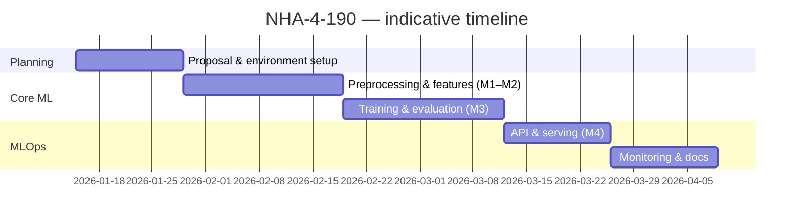

# Project Planning & Management

## 1. Project proposal (overview)

**Title:** AI-powered predictive maintenance for industrial equipment (NHA-4-190).

**Objectives**

- Build an end-to-end ML pipeline from the AI4I 2020 dataset through trained, evaluated models.
- Deploy a real-time **FastAPI** inference service aligned with the offline feature pipeline.
- Add **monitoring** (PSI drift, prediction volume, feedback-based metrics) and optional **auto-retrain**.

**Scope (in scope)**

- Binary classification: predict **machine failure** from sensor readings and engineered features.
- REST API: `/health`, `/predict`, `/feedback`, `/metrics`, `/drift`.
- File-based artifacts: trained models (joblib), threshold JSON, CSV logs, YAML config.

**Scope (out of scope for this submission)**

- Multi-class failure-type prediction, RUL estimation, deep learning models, public cloud hosting, production SSO, and a full web UI dashboard (listed under [Future work](03_system_design.md#7-future-extensions)).

## 2. Project plan & milestones

| Milestone | Deliverable |
|-----------|-------------|
| M1 | Data preprocessing (`src/data_preprocessing.py`), validated inputs |
| M2 | Feature engineering (`src/feature_engineering.py`), notebook EDA |
| M3 | Train/evaluate RF & XGBoost, thresholds, `main.py` pipeline |
| M4 | `app.py` API, `src/serving.py`, `monitoring/monitor.py`, logs & drift |

### Timeline (Gantt)

Adjust dates to match your course calendar.

## 3. Task assignment & roles

| Role | Responsibilities |
|------|------------------|
| **Data & features** | Preprocessing, feature engineering, reproducibility |
| **Modeling** | Training, GridSearch (optional skip), metrics, threshold tuning |
| **Deployment** | FastAPI, `RollingFeatureStore`, alignment to `feature_names_in_` |
| **MLOps / QA** | Monitoring script, drift PSI, test plan, documentation |

*If you are a solo team, list your name in all rows and delete unused roles.*

## 4. Risk assessment & mitigation

| Risk | Impact | Mitigation |
|------|--------|------------|
| Class imbalance (~3.4% failures) | Poor recall | SMOTE on **train only**; Fβ (β=2) threshold optimization |
| Temporal leakage | Overstated metrics | `shuffle: false` in config; SMOTE after split |
| Train vs serve feature mismatch | Wrong predictions | Shared config; `RollingFeatureStore`; column alignment in `serving.py` |
| Drift in production | Silent degradation | PSI vs training reference; thresholds in `config.yaml`; optional retrain |
| Missing dataset file | Pipeline fails | Document `data/raw/ai4i2020.csv`; validate in README |

## 5. KPIs (key performance indicators)

| KPI | Target | How measured |
|-----|--------|----------------|
| **Recall (failure detection)** | ≥ 0.80 on held-out or feedback-evaluated data | `model_evaluation.py` / monitoring report |
| **API availability** | Demo / local: service starts; health returns `ok` | `GET /health` |
| **Prediction latency (batch demo)** | Reasonable on CPU (course demo) | Manual timing or simple logging |
| **Drift alerting** | Flag when avg PSI ≥ configured threshold | `GET /drift` vs `monitoring.psi_threshold` |
| **Reproducibility** | Same config + data → repeatable training | `python main.py`, seeds in `config.yaml` |

## 6. Version control & branching strategy

- **`main`:** stable, submission-ready code.
- **Feature branches:** `feature/<short-name>` (e.g. `feature/monitoring-tweak`) merged via PR for traceability.
- **Commits:** imperative, scoped messages (e.g. `Add PSI drift endpoint`).

If your course requires a diagram-only “GitFlow” picture, reuse the deployment section in [03_system_design.md](03_system_design.md) and reference this policy here.
