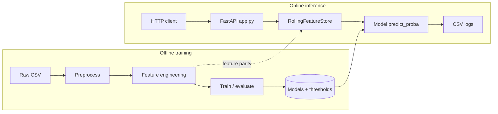
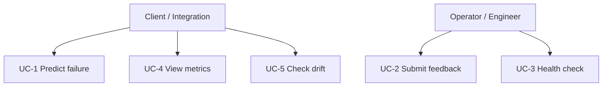
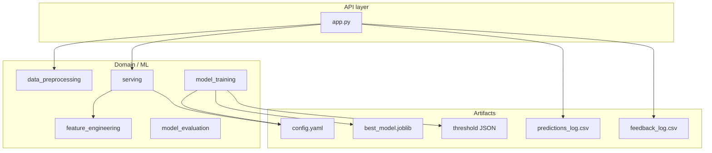
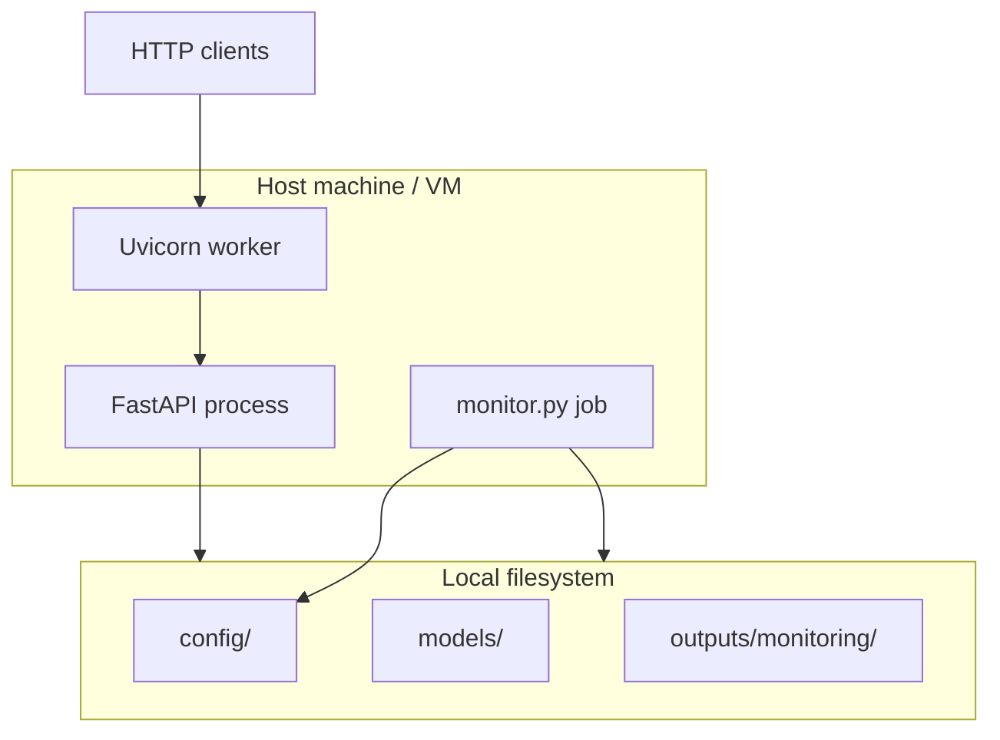
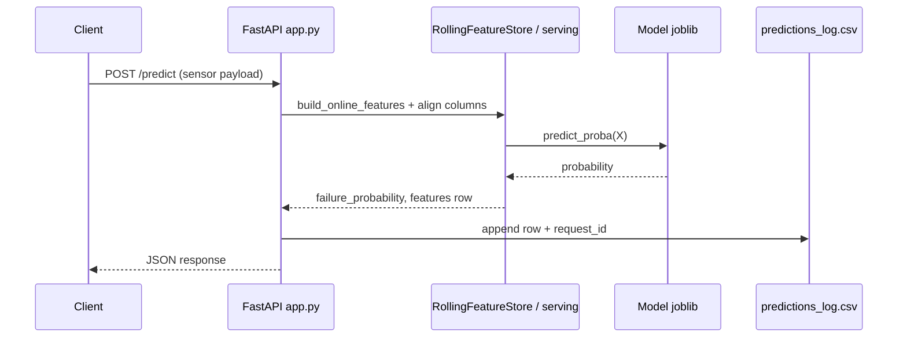
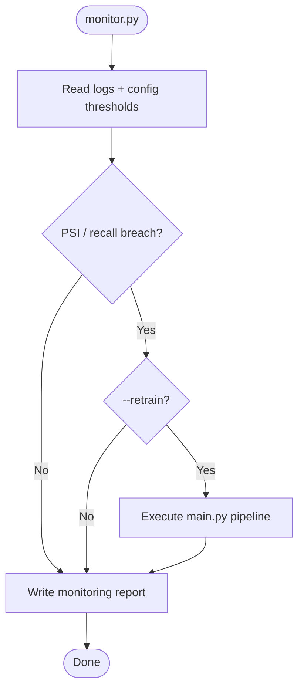
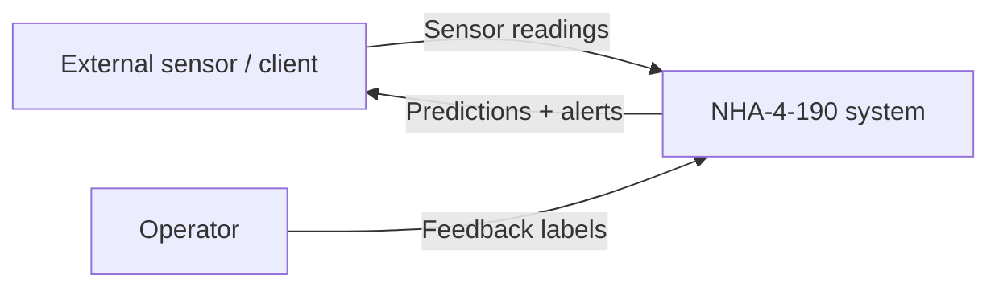
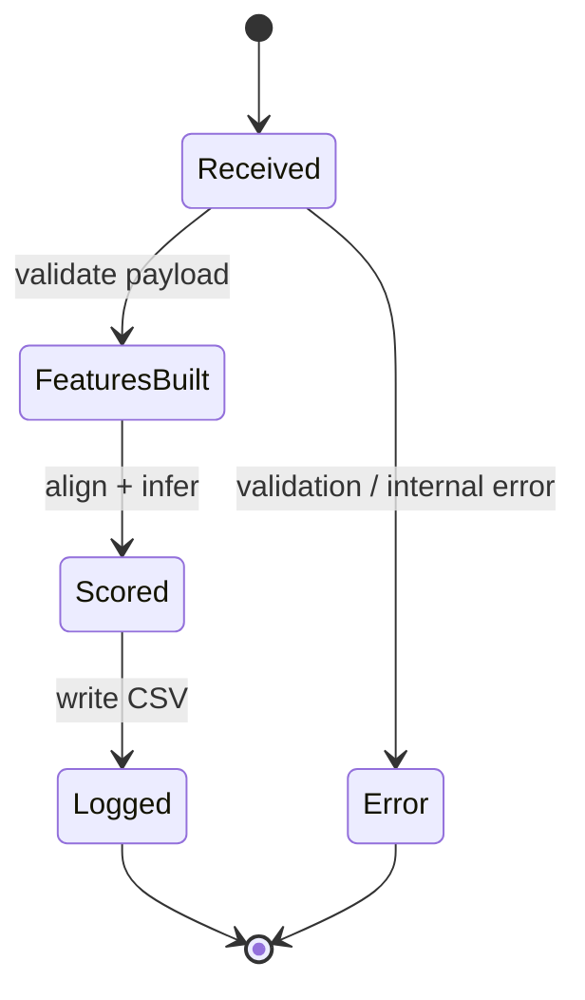
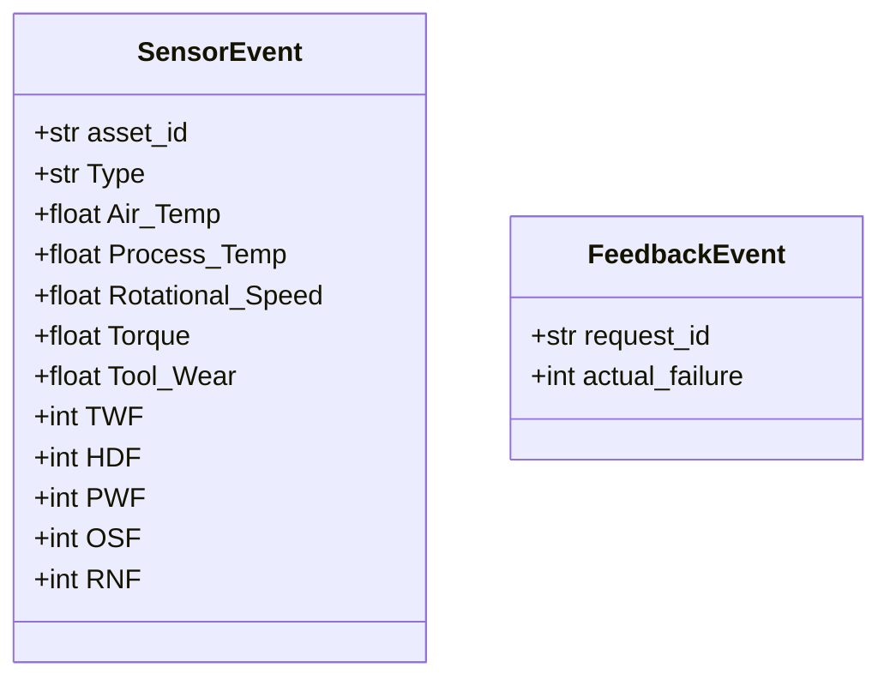

# System Analysis & Design

## 1. Problem statement & objectives

**Problem:** Reactive maintenance causes downtime and cost; scheduled maintenance is inefficient. Sensor-rich equipment can support **condition-based** decisions if failure risk is estimated accurately and kept stable in production.

**Objectives:** Ingest IoT-style readings, engineer discriminative features, train binary classifiers with imbalance-aware validation, deploy a **real-time API** with **monitoring** aligned to the training pipeline.

## 2. High-level architecture

The system follows a **modular Python** layout: offline **training pipeline** (`main.py` + `src/`) and online **serving** (`app.py` + `src/serving.py`) sharing **YAML config** and **joblib** artifacts.

**Style:** Layered **API + domain + data** (not full MVC); suitable for a small ML service.

## 3. Use case diagram

## 4. Component diagram

## 5. Deployment diagram (logical)

*Production would add reverse proxy, TLS, process manager, and remote artifact store.*

## 6. Sequence — prediction (`POST /predict`)

## 7. Activity — monitoring & optional retrain

## 8. Data flow (context DFD)

**Context (level 0):**

**Level 1 (summary):** Raw file → preprocess → features → model → API response; parallel path: logs → drift/metrics.

## 9. State diagram — prediction request (simplified)

## 10. Class diagram — API models (Pydantic)

*Full OO design for sklearn estimators is intentionally shallow; the project centers on pipelines and functions.*

## 11. Technology stack

| Layer | Technology |
|-------|------------|
| Language | Python 3.10+ |
| ML | scikit-learn, XGBoost, imbalanced-learn |
| API | FastAPI, Uvicorn, Pydantic v2 |
| Config | PyYAML |
| Serialization | joblib |

## 12. API documentation

Authoritative request/response shapes are defined in **`app.py`** and the auto-generated **OpenAPI** docs at `/docs` when the server runs.

| Method | Path | Purpose |
|--------|------|---------|
| GET | `/health` | Liveness + model metadata |
| POST | `/predict` | Failure probability + binary decision |
| POST | `/feedback` | Record actual outcome for a `request_id` |
| GET | `/metrics` | Totals and predicted failure rate from log |
| GET | `/drift` | PSI summary vs training reference |

## 13. Future extensions

- LSTM / transformers on longer sequences  
- Multi-class failure modes  
- Remaining useful life (RUL)  
- Edge deployment  
- Web dashboard for fleet health  
- A/B testing for retrain validation  
