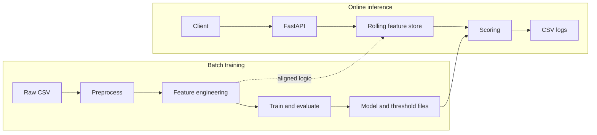
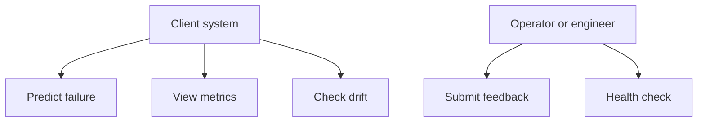
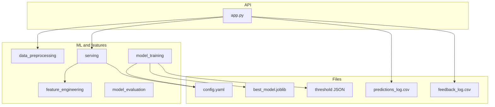
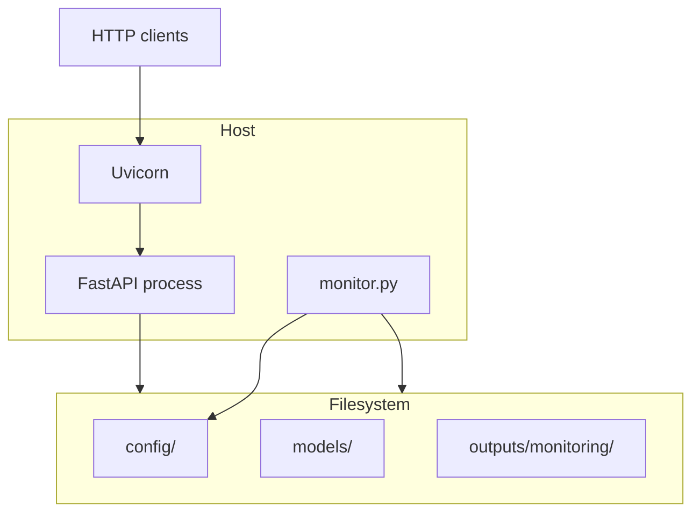
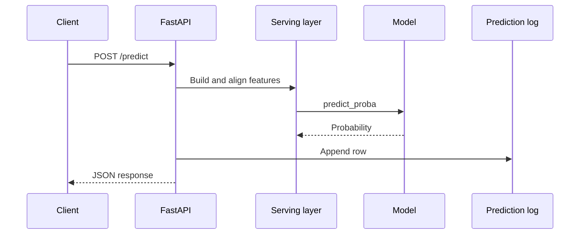
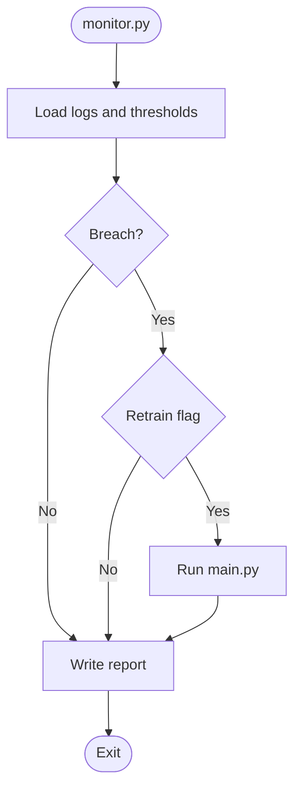
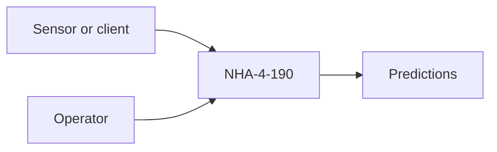
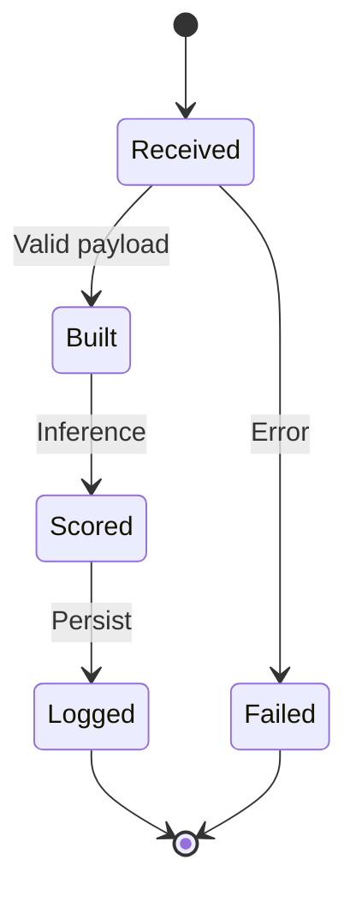
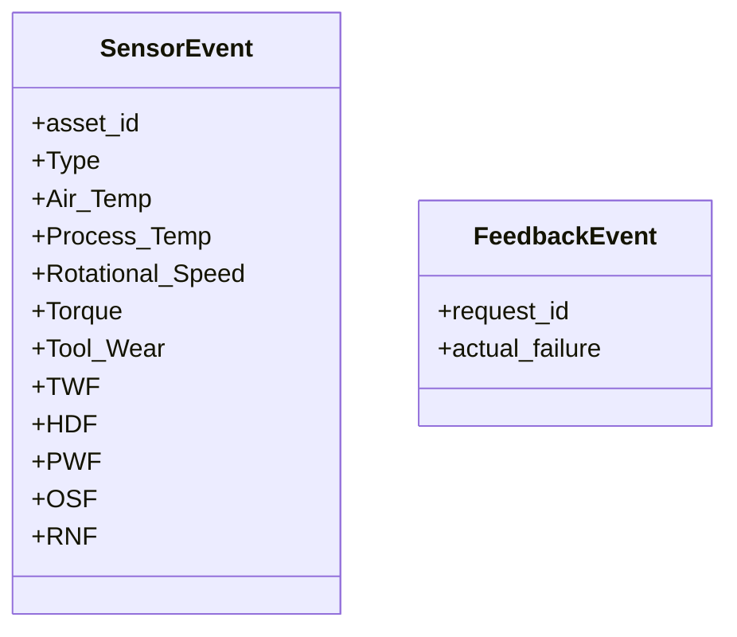

# System analysis and design

## Problem and goals

Unplanned failures drive downtime and cost; calendar-based maintenance wastes effort. The system estimates failure risk from sensor streams so maintenance can be triggered on condition rather than only on schedule or after breakdown.

Goals: ingest readings compatible with AI4I 2020, apply the same feature logic in batch and online settings, train and select a binary classifier under imbalance, expose inference over HTTP, and support basic production checks (logging, drift, optional retrain).

## Architecture

Training is batch-oriented (`main.py`, modules under `src/`). Inference is a FastAPI application (`app.py`) that reuses preprocessing and feature logic via `src/serving.py`. Both paths read `config/config.yaml` and the same joblib model and threshold files.

The structure is a small service-oriented layout: HTTP layer, scoring and feature helpers, and file-backed persistence.

## Use cases (diagram)

## Components

## Deployment (logical)

A hardened deployment would add a reverse proxy, TLS, process supervision, and remote artifact storage.

## Sequence: prediction

## Activity: monitoring

## Data flow (context)

Level 1: raw file → preprocess → features → score → response; logs feed metrics and drift.

## Request state (simplified)

## API payload models (Pydantic)

Estimator internals follow scikit-learn conventions; the design emphasises pipelines and explicit feature names.

## Technology

| Layer | Choice |
|--------|--------|
| Runtime | Python 3.10+ |
| ML | scikit-learn, XGBoost, imbalanced-learn |
| API | FastAPI, Uvicorn, Pydantic v2 |
| Config | PyYAML |
| Model storage | joblib |

## REST surface

Schemas are defined in `app.py`. With the server running, OpenAPI is available at `/docs`.

| Method | Path | Role |
|--------|------|------|
| GET | `/health` | Liveness and model metadata |
| POST | `/predict` | Score one observation |
| POST | `/feedback` | Attach label to `request_id` |
| GET | `/metrics` | Aggregates from the prediction log |
| GET | `/drift` | PSI summary vs training reference |

## Future work

- Sequence models (e.g. LSTM or transformer) for longer histories  
- Per failure-mode classification  
- RUL estimation  
- On-device or edge inference  
- Operator dashboard  
- Controlled experiments on retrained models  
