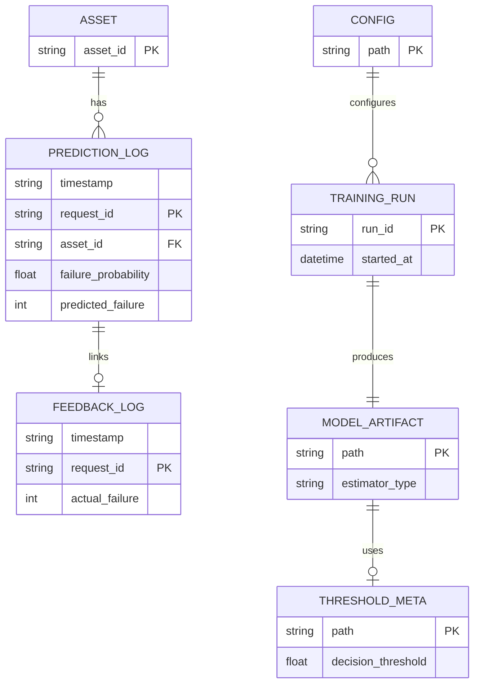

# Data model

The reference implementation does not rely on a relational database. Training data, configuration, model binaries, and operational logs are files on disk. The diagram below is a logical view: it names the entities and relationships you would implement if these were stored in SQL.

## Logical ER view

Prediction rows include additional columns for engineered features (aligned with `feature_names_in_`) so drift calculations can read one file without joins.

## File mapping

| Entity (logical) | Path (default) | Format |
|-------------------|----------------|--------|
| Training set | `data/raw/ai4i2020.csv` | CSV |
| Settings | `config/config.yaml` | YAML |
| Estimator | `models/best_model.joblib` | joblib |
| Decision threshold | Path in `deployment.threshold_path` | JSON |
| Prediction log | `outputs/monitoring/predictions_log.csv` | CSV |
| Feedback log | `outputs/monitoring/feedback_log.csv` | CSV |
| Monitoring output | `outputs/monitoring/latest_monitoring_report.json` | JSON |
| Evaluation plots | `outputs/plots/` | PNG |

Paths under `deployment` and `monitoring` in `config/config.yaml` override these defaults when changed.

## Keys and consistency

- `request_id` uniquely identifies a prediction and joins to feedback.
- `asset_id` scopes rolling-window state per machine; the API default is a single shared id if none is supplied.
- CSV stores do not enforce foreign keys; callers must use the `request_id` returned from `/predict` when posting `/feedback`.

## Denormalisation

Feature columns are stored in the prediction log to keep logging append-only and to support per-feature PSI without ETL. A data-warehouse design would typically split facts and dimensions; that is outside this repository’s scope.
